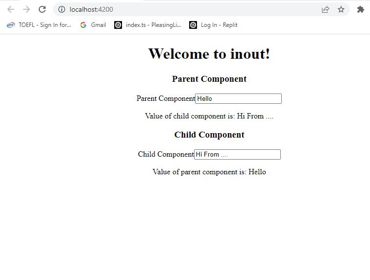

# Inout

This project was generated with [Angular CLI](https://github.com/angular/angular-cli) version 14.1.3.

Here We are trying to show the usage of @input and @output using parent and child component

## Development server

Run `ng serve` for a dev server. Navigate to `http://localhost:4200/`. The application will automatically reload if you change any of the source files.

## The output is seen as below :

